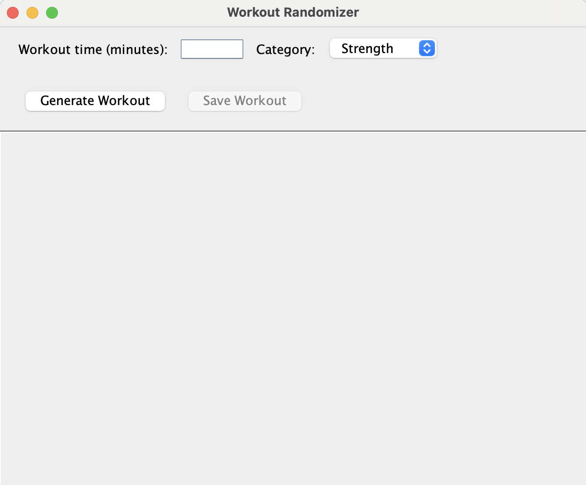

# WorkoutRandomizer_App

WorkoutRandomizer_App is a Java-only utility application that generates randomized workouts based on your desired workout time and category. Users can save their generated workouts as text files. The app features a simple GUI built with Java Swing and can run from the terminal or as a runnable JAR.

## Features
- Input desired workout time (in minutes)
- Select an exercise category: Strength, Cardio, Stretching, or All
- Generate randomized workout plans that match your requested duration
- Save workouts as `.txt` files
- Simple and user-friendly Java Swing GUI

## Installation

### Prerequisites
- Java JDK 17 or higher
- Git (optional, for cloning the repository)

### Steps
1. Clone the repository:
```
git clone https://github.com/tamaramillerf/WorkoutRandomizer_App.git
```
2. Navigate to the project folder:
```
cd WorkoutRandomizer_App
```
3. Compile all Java files:
```
javac *.java
```
4. Run the app:
```
java WorkoutRandomizerSwing
```

### Optional: Create a Runnable JAR
```
jar cfe WorkoutRandomizer.jar WorkoutRandomizerSwing *.class
java -jar WorkoutRandomizer.jar
```

### Optional: Install Globally

**Mac/Linux:**
```
echo 'java -jar /path/to/WorkoutRandomizer.jar' > /usr/local/bin/workoutrandomizer
chmod +x /usr/local/bin/workoutrandomizer
workoutrandomizer
```

**Windows:**
```
@echo off
java -jar "C:\path\to\WorkoutRandomizer.jar"
pause
```
Save as `WorkoutRandomizer.bat` in a folder included in your PATH to run from anywhere.

## Usage
1. Launch the app (`java -jar WorkoutRandomizer.jar` or `java WorkoutRandomizerSwing`)
2. Enter your desired workout time in minutes
3. Select the exercise category
4. Click **Generate Workout**
5. Review your randomized workout plan
6. Click **Save Workout** to save the plan as a `.txt` file

## Screenshot


## Code Structure
- `Exercise.java` — defines an exercise (name, duration, category)
- `ExerciseLibrary.java` — stores all exercises
- `WorkoutRandomizer.java` — generates workouts based on time and category
- `WorkoutRandomizerSwing.java` — GUI, input, and save functionality

## License
This project is for educational purposes.
